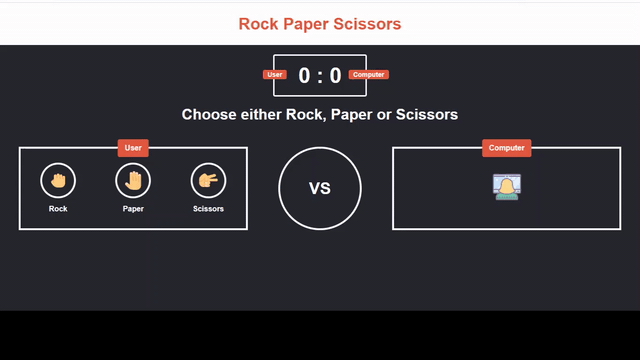

## Rock Paper Scissors Sample Game

# <a href = "https://gurjeetmor.github.io/RockPaperScissorsGame/" > Play Here </a>

# Project Overview

The idea of ​​the Rock Paper Scissors game is as follows:

 <ul>
 <li>Two players face each other (in our case it will only be against the computer).</li>
 <li>On the count of three, both players choose an option: rock (closed fist), paper (open hand) or scissors (symbol of peace).</li>
 <li>Each option can beat the other:
 <ul>
 <li>Rock crushes the Scissors.<li>
 <li>Scissors cut the Paper.</li>
 <li>Paper covers the Rock.<li>
 </ul>
 </li>
 </ul>

 
For this project, user can choose one of the three options as shown in image and the computer will choose its option.

 
The image is our central view that contains the score board with user and computer score, 
 user game board contains three buttons with the three game options and computer game board contain the computer emoji.
 From here the game will start and the user can click on one of the three options (rock, paper or scissors).

 
Subsequently, the visual elements change and you see the second screen 
 (which really remains the first screen only that the border color changed according to the game result 
 and some elements were hidden) with the option selected by the user (left) with label and that of the computer (right) with another label. 
 Like another label to indicate the result of the game and a button to restart the game.

